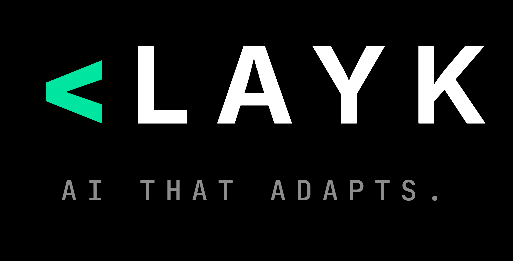

  

  <strong>AI-native business platform.</strong> 
  Implantamos um ambiente digital sob medida — processos, dados, automações e IA
  conectados no ecossistema da empresa. 
  Não é mais um SaaS por cima do que já existe. É entrega completa.

  <a href="https://layk.com.br">layk.com.br</a>
  &nbsp;·&nbsp;
  <a href="https://instagram.com/layk.tech">@layk.tech</a>
  &nbsp;·&nbsp;
  <a href="https://www.linkedin.com/company/layk-tech">LinkedIn</a>
  &nbsp;·&nbsp;
  <a href="mailto:contato@layk.com.br">contato@layk.com.br</a>

---

### O que fazemos

- **SaaS sob medida** — do MVP ao enterprise, em semanas.
- **Automações com agentes de IA** — trabalho que roda sozinho.
- **Dashboards inteligentes** — dados em tempo real, decisão sem achismo.
- **WhatsApp AI** — atendimento, qualificação e vendas.
- **Sistemas financeiros** — conciliação, billing, fintech.
- **Plataformas operacionais** — substituem planilhas.

### Stack

`React 19` · `TypeScript` · `TanStack Start` · `Tailwind v4` · `Supabase` · `Cloudflare` · `Three.js`

Infra com 99.99% de uptime, SOC2-ready, LGPD compliant. IA nativa no processo de
desenvolvimento — MVPs em semanas, não meses.

---

  <code>AI THAT ADAPTS.</code>

